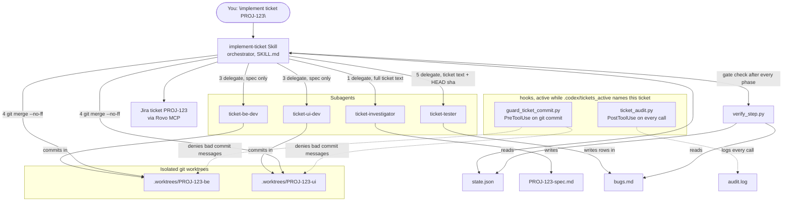
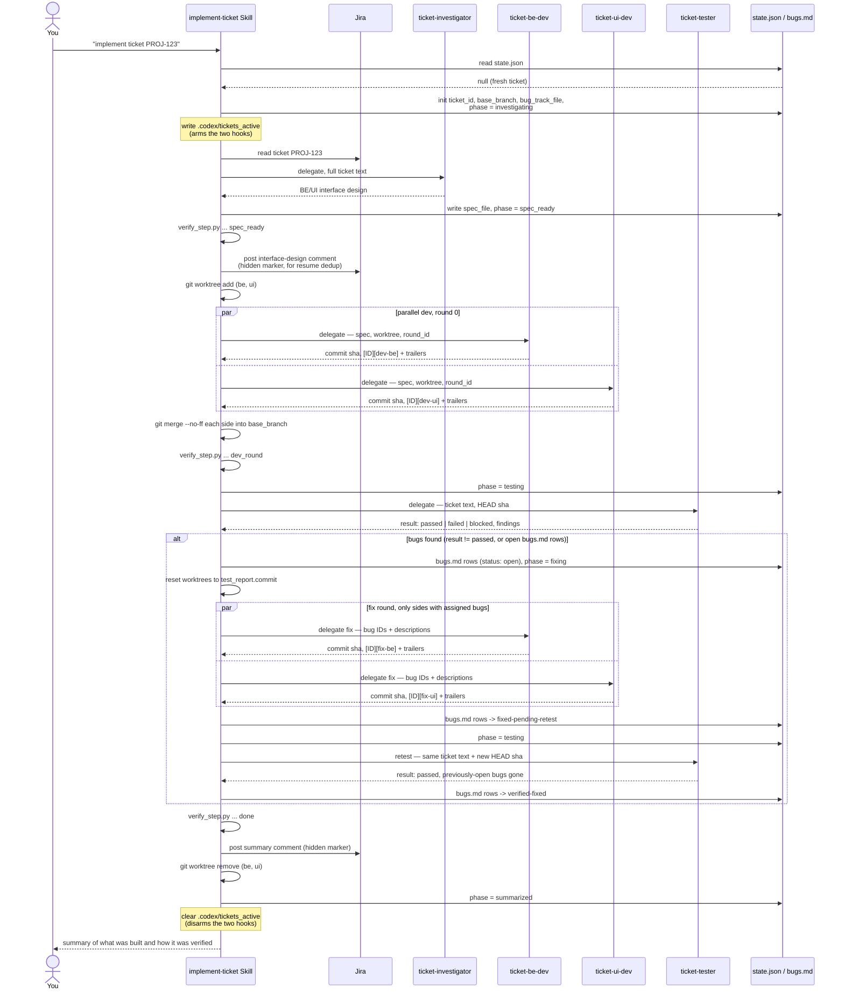

# ticket-workflow — a Codex plugin for end-to-end Jira ticket implementation

Say "implement ticket PROJ-123" and this plugin's Skill orchestrates: read
the ticket from Jira → investigate the codebase and design a BE/UI
interface → post that design back to the ticket → implement both sides in
parallel (isolated git worktrees, so two subagents can commit at once
safely) → test against the ticket's real acceptance criteria → loop fixes
until clean → summarize and comment on the ticket. Resumable if the session
stops at any point — a fresh `codex` session picks up exactly where the
last one left off, reconciled against real git/Jira state rather than a
blindly-trusted local file.

Full design rationale and the "why" behind every mechanism:
`docs/specs/2026-09-13-ticket-workflow-plugin-design.md` in the repo this
plugin was built alongside (if you have it) — this README is the practical
how-to and reference.

## How it works

The Skill (`implement-ticket`) is the only orchestrator. It never writes
application code or runs `git commit` itself — it delegates each piece of
work to one of 4 subagents, and does only the bookkeeping: `state.json`,
`bugs.md`, Jira comments, and the worktree/merge git commands. Two hooks
watch every tool call while a ticket is active, and a small gate script
(`verify_step.py`) re-derives ground truth from git/the filesystem before
the Skill is allowed to advance a phase — so a subagent's self-report is
never trusted on its own.



### Component reference

| File | Role |
|---|---|
| `skills/implement-ticket/SKILL.md` | The orchestrator prose — the only thing that reads `state.json`/`bugs.md` and decides what happens next. |
| `agents/ticket-investigator.toml` | Reads the ticket text (given by the Skill, never fetches it itself) and the existing codebase; writes the BE/UI interface spec. Read-only against code. |
| `agents/ticket-be-dev.toml` / `ticket-ui-dev.toml` | Implement one side each, from the spec file only — never see the original ticket. Work entirely inside their own git worktree; the only thing they touch outside it is their own commit. |
| `agents/ticket-tester.toml` | Tests the integrated result against the **original ticket's** acceptance criteria (not the spec — deliberately, to catch drift between what was asked and what was built). Returns a structured `passed`/`failed`/`blocked` report; never edits `bugs.md` itself. |
| `hooks/guard_ticket_commit.py` | PreToolUse hook on `Bash`. While a ticket is active, denies any `git commit` whose message doesn't match `[<ID>][dev-be\|dev-ui\|fix-be\|fix-ui] <summary>`. |
| `hooks/ticket_audit.py` | PostToolUse hook on every tool call. Appends one line per call to `tickets/<ID>/audit.log` — a durable trace that survives a lost session, independent of any transcript. |
| `hooks/verify_step.py` | Not a lifecycle hook — a gate script the Skill runs explicitly after each phase (`spec_ready`, `dev_round`, `done`). Re-derives the truth from git (commit trailers, merge-base ancestry, checkout cleanliness) and from `bugs.md`'s actual rows, rather than trusting what the Skill or a subagent already wrote to `state.json`. Exit 0 = phase satisfied, non-zero = not yet, with the reason on stdout. |
| `hooks/state_io.py` | Atomic read/write for `state.json` (writes to a `.tmp` file and `os.replace()`s it — never a half-written file after an interruption). |
| `hooks/merge_config.py` | Key-aware TOML merge used only by `install.sh`, to add this plugin's MCP/feature config into an existing `.codex/config.toml` without clobbering anything already there. |
| `install.sh` + `*-snippet.*` | Copies everything above into a target repo and merges the config/hooks snippets in. Idempotent — safe to re-run. |

### Configuring a subagent (model, per-role tuning)

`.codex/agents/<role>.toml` isn't limited to `name`/`description`/
`developer_instructions` — Codex reads a specific whitelist of fields from
each role file into the spawned agent's effective config, and silently
drops anything outside it (verified against `core/src/agent/role.rs`, same
check this repo's own `.codex/agents/secret-auditor.toml` already
documents):

| Field | Honored? |
|---|---|
| `name`, `description` | Yes |
| `developer_instructions` | Yes |
| `model` | Yes — overrides the model for just this role |
| reasoning / personality / service_tier knobs | Yes in principle, but this plugin doesn't set them — their exact TOML key names weren't independently verified here, so guessing at them risks the same silent-no-op trap as `sandbox_mode` below |
| features / skills | Yes, but disable-only — a role can turn things off, not grant itself anything the parent session doesn't already have |
| `sandbox_mode` | **No** — parses without error, has zero effect; the role inherits whatever sandbox the parent session is running under |

This plugin uses the whitelist's one clearly-documented lever: `model` per
role. In production, the two roles that make open-ended judgment calls
would warrant a stronger model than the two that execute an
already-designed spec; for a live demo, all four are pinned to the
cheaper/faster model instead, to keep token spend and wall-clock latency
down across the whole workflow.

| Role | `model` | Why |
|---|---|---|
| `ticket-investigator` | `gpt-5.6-luna` | Reads the whole target codebase and designs the BE/UI interface — open-ended judgment that would argue for `gpt-6-astra` in production. |
| `ticket-tester` | `gpt-5.6-luna` | Independently judges whether real acceptance criteria are met, not just re-checking the spec — same production tradeoff as above. |
| `ticket-be-dev` | `gpt-5.6-luna` | Implements a spec that's already been designed — closer to mechanical execution. |
| `ticket-ui-dev` | `gpt-5.6-luna` | Same. |

Those slugs are what this repo's own Codex install happened to have when
this was written — run `codex debug models` yourself to see what's
actually available on yours before copying these verbatim. For real
(non-demo) ticket work, swap `ticket-investigator` and `ticket-tester`
back to your install's strongest model.

## The full ticket lifecycle



**Resuming an interrupted session** re-enters at step 0 in `SKILL.md`, before
any of the above: it reads `state.json`, then reconciles every piece of it
against ground truth rather than trusting it — searching Jira comments for
the hidden markers instead of re-posting, comparing each worktree's actual
branch tip against what `dev_round` recorded, and re-verifying `merged`
claims with `git merge-base --is-ancestor`. If the interruption happened
mid-fixing-round, resuming continues that same round (same `round_id`,
no extra `retry_count` burned) instead of starting a new one.

### Phase & state reference

`state.json` lives at `tickets/<ID>/state.json` (gitignored — this is
working state, not a second copy of anything that belongs durably on the
Jira ticket itself). Field names and enums are fixed contracts between
`SKILL.md` and `verify_step.py` — nothing else in the plugin renames them:

| Field | Values / shape |
|---|---|
| `phase` | `investigating` → `spec_ready` → `testing` ⇄ `fixing` → `summarized` (`dev_conflict` if a merge needs a human) |
| `dev_round.<side>.status` | `pending` → `committed` → `merged`, or `no_bugs_assigned` (a fixing-round side with nothing to do) |
| `dev_round.<side>.sync_status` | `pending` → `ready` (fixing rounds only — after the worktree is reset to `synced_from_commit`) |
| `test_report.result` | `passed` \| `failed` \| `blocked` (`blocked` = testing itself couldn't complete — a build failure, a dirty checkout — distinct from `failed`, a criterion genuinely not met) |
| `bugs.md` row `Status` | `open` → `fixed-pending-retest` → `verified-fixed`, or `wont-fix` (always human-approved, never automatic) |

Every dev/fix commit carries 4 trailers `verify_step.py` checks before
trusting a `merged`/`committed` claim:
```
Ticket-Workflow: <ticket-id>
Ticket-Round: <round-id>
Ticket-Side: be|ui
Ticket-Complete: true
```

The `done` gate (`verify_step.py ... done`) requires all of: `test_report`
says `passed`, its `commit` matches `base_branch`'s current HEAD (not
stale), the checkout is clean, and every `bugs.md` row is
`verified-fixed`/`wont-fix` — an empty `bugs.md` alone is not enough to
call a ticket done.

## Prerequisites

- Codex CLI, logged in and trusted for the target repo.
- Python 3.11+ (uses `tomllib`, stdlib since 3.11) and `git`.
- An Atlassian Cloud site with Jira, with the Rovo MCP Server available
  (on by default for most sites; a locked-down org may need an admin to
  enable it).

## Install

From the target repo's root:

```bash
bash /path/to/plugins/ticket-workflow/install.sh
```

This copies the skill, the 4 subagent roles, and the hook scripts into
`.agents/skills/` and `.codex/`, and key-merges (never blindly overwrites)
the MCP/feature config into `.codex/config.toml` and the two new hooks into
`.codex/hooks.json`. Safe to re-run — it's idempotent.

Then:
```bash
codex                        # trust the project (required once)
```
Inside that session, run `/hooks` and approve the two new hooks
(`guard_ticket_commit.py`, `ticket_audit.py`) — project-level hooks need
this explicit approval before they're active.

If the target repo tracks `.codex/config.toml`/`.codex/hooks.json` (as this
one does), commit (or stash) the files `install.sh` just added/modified
before running `implement ticket ...` — the Skill's entry preconditions
require a clean checkout to start.

**Sanity-check the commit guard** before relying on it (a bare terminal
`git commit` never triggers a Codex hook — hooks only fire for tool calls
Codex's own agent loop makes):
```bash
echo DEMO-1 > .codex/tickets_active
echo '{"tool_name":"Bash","tool_input":{"command":"git commit -m \"bad message\""}}' \
  | python .codex/hooks/guard_ticket_commit.py
# expect JSON with permissionDecision: "deny"
rm .codex/tickets_active
```

Finally:
```bash
codex mcp login atlassian    # OAuth browser login to Jira
```

## Use it

Inside `codex`, in the target repo:
```
implement ticket PROJ-123
```
or explicitly: `$implement-ticket PROJ-123`.

To resume after an interrupted session, say the same thing again with the
same ticket ID — see "Resuming an interrupted session" above for exactly
what that re-checks before continuing.

Progress artifacts (all local-only, gitignored by the installer):
- `tickets/<ID>/state.json` — machine-readable progress/resume state
- `tickets/<ID>/<ID>-spec.md` — the BE/UI interface design
- `tickets/<ID>/bugs.md` — the bug tracker for the fix-retest loop
- `tickets/<ID>/audit.log` — every tool call made during this ticket's work

## Known limitations

- `guard_ticket_commit.py` only inspects the literal `tool_input.command`
  string — a message via `-F <file>`, an interactive `--amend`, or a
  `git commit` issued later in a `&&`/`;` chain aren't reliably caught.
  The workflow itself never issues those forms.
- Subagent role `sandbox_mode` fields are silently dropped by Codex (a
  known behavior, not specific to this plugin) — the 4 roles are read/
  write-scoped by instruction, not OS-enforced sandboxing.
- Requires an Atlassian Cloud Jira site; there is no offline/mock mode.

## Running this plugin's own test suite (dev-only)

```bash
cd demo-material/plugins/ticket-workflow
pip install -r tests/requirements-dev.txt   # dev-only, not needed to just use the plugin
python -m pytest tests/ -v
```
